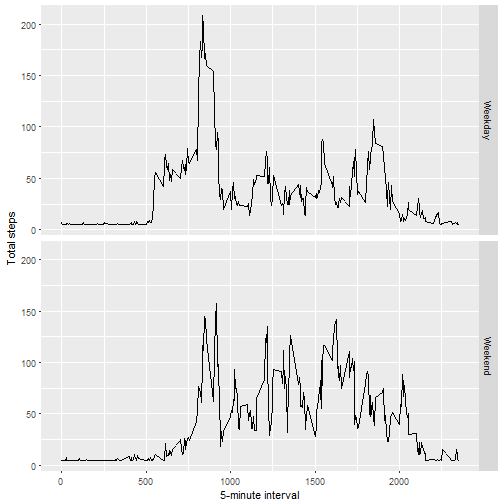

## Proyecto Semana 2 Reproducible Research

Este proyecto hace uso de datos de un dispositivo de monitoreo de actividad personal. Este dispositivo recopila datos en intervalos de 5 minutos durante todo el día. Los datos consisten en dos meses de datos de una persona anónima recopilada durante los meses de octubre y noviembre de 2012 e incluyen la cantidad de pasos realizados en intervalos de 5 minutos cada día.
El data set esta disponible en la siguiente liga: <https://d396qusza40orc.cloudfront.net/repdata%2Fdata%2Factivity.zip>.


### Librerias a usar 

* stringi
* lattice
* survival
* Formula 
* ggplot2
* Hmisc


### Carga y procesamiento de los datos
  
Cargar los datos y transformarlos (de ser necesario) para el procesamiento y analisis.

```r
stepsData <- read.csv("activity.csv", header = TRUE)
stepsData$date <- as.Date(stepsData$date)
```

### Cual es el promedio total de pasos dados por dia?
Se obtiene el total de pasos dados por dia. 

```r
TotalSteps <- tapply(stepsData$steps, stepsData$date, FUN = sum, na.rm = TRUE)
qplot(TotalSteps, binwidth = 1000, xlab = "total number of steps taken each day")
```


Se obtiene la media y media del conjunto de datos que contiene el total de pasos dados por dia. 

```r
mean(TotalSteps, na.rm = TRUE)
```

```
## [1] 9354.23
```

```r
median(TotalSteps, na.rm = TRUE)
```

```
## [1] 10395
```


### ¿Cuál es el patrón de actividad diaria promedio?
Se obtiene el promedio de los pasos por intervalo y se hace el grafico

```r
meansteps <- tapply(stepsData$steps, stepsData$interval, mean, na.rm = TRUE)
plot(meansteps, type="l", col="hotpink", xlab="5-minute intervals", ylab="Average Steps", main = "Average daily activity pattern")
```


Se obtiene el intervalo que contiene el numero maximo de pasos.

```r
meansteps <- as.data.frame.table(meansteps)
names(meansteps) <- c("interval","avsteps")
meansteps[which.max(meansteps$avsteps),]
```

```
##     interval  avsteps
## 104      835 206.1698
```


### Imputing missing values
El total de missing values:

```r
missingSteps <- is.na(stepsData$steps)
table(missingSteps)
```

```
## missingSteps
## FALSE  TRUE 
## 15264  2304
```
Se usa la funcion impute del paquete Hmisc como metodo para imputar los datos. 

```r
imputeStepsData <- stepsData
imputeStepsData$steps <- impute(imputeStepsData$steps, fun=mean)
imputedTotalSteps <- tapply(imputeStepsData$steps, imputeStepsData$date, sum)
qplot(imputedTotalSteps,binwidth=500, xlab = "Total steps per day", ylab = "Frequency")
```


###Are there differences in activity patterns between weekdays and weekends?
Se construye una funcion que determine si una fecha cae en dia entre semana (weekday) o en fin de semana (weekend). Posteriormente se hace la asginacion de esta nueva variable al dataframe, y se hace el grafico deacuerdo a la distribucion de los pasos con el intervalo y el tipo de dia. 

```r
WeekDayOrEnd <- function(date){
  daytype <- weekdays(date)
  if (daytype %in% c("lunes", "martes", "miércoles", "jueves", "viernes")) {
    return("Weekday")
  }else if (daytype %in% c("sábado", "domingo")) {
    return("Weekend")
  }else{return("Invalid date")}
}

imputeStepsData$dayType <- sapply(imputeStepsData$date, WeekDayOrEnd)
averages <- aggregate(steps ~ interval + dayType, data = imputeStepsData, mean)
ggplot(averages, aes(interval, steps)) + geom_line() + facet_grid(dayType ~ .) + xlab("5-minute interval") + ylab("Total steps")
```




